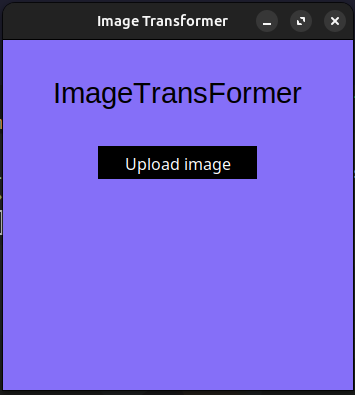

# Image transformations

## Usage

1. Pick file
   

1. Choose effects
   

1. Quantize
   

1. Dither
   

1. Sketch
   

## Setup

Install packages using [uv](https://github.com/astral-sh/uv)

```bash
uv venv
uv pip install
```

## Run application

```bash
uv run main.py
```
